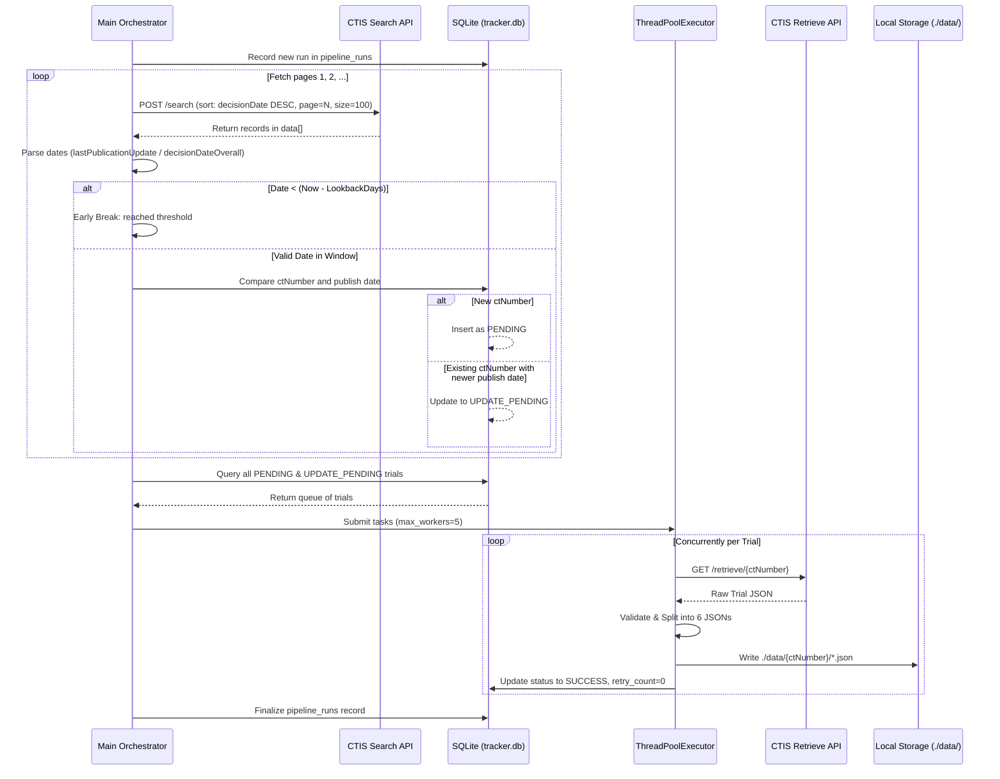

# EU CTIS Data Pipeline - ETL Implementation Guide

**Document Version:** 1.1 (Verified & Enhanced)  
**Target Environment:** Local Python ETL Pipeline (Modular architecture prepared for cloud migration)  
**Primary Data Source:** EU Clinical Trials Information System (CTIS) Public REST API  

---

## 1. Project Overview & Scope

The objective is to build a reliable, maintainable, and incremental Python ETL (Extract, Transform, Load) pipeline that ingests clinical trial records from the European Medicines Agency (EMA) CTIS public API, transforms them into 6 domain-specific JSON files per trial, and stores them in organized local directory hierarchies.

### 1.1 Critical Domain Context

* **Volume & Database Scope:**
  * The public CTIS search portal exposes trials submitted under the EU Clinical Trials Regulation (CTR EU No 536/2014, in force since January 31, 2022).
  * As of late 2026, CTIS hosts approximately **~12,500–13,000 trials**.
  * The historical legacy database **EudraCT** contains older trials (~31,000+ studies). EudraCT is separate and not exposed by the CTIS public API endpoints. This pipeline strictly targets the modern **CTIS API**.
* **Target Output:**
  * Each clinical trial (`ctNumber`, e.g., `2026-527084-15-00`) is parsed into a dedicated folder containing **6 discrete JSON files**.
  * Deeply nested nested structures from the raw monolithic API response are normalized into clean, modular entities.
* **Pipeline Principles:**
  * **Idempotency:** Re-running the pipeline on previously processed data must not corrupt state or duplicate records.
  * **Incremental Daily Synchronization:** Daily runs must only process newly registered or recently amended trials using a configurable lookback window (default: 7 days) without re-scraping the entire dataset.
  * **Fault Tolerance & Quarantine:** Malformed records or schema regressions must be trapped into a quarantine folder rather than terminating the pipeline batch.

---

## 2. Architecture Overview

```mermaid
flowchart TD
    A[Start Pipeline] --> B[Check / Init SQLite DB tracker.db]
    B --> C{Run Mode?}
    C -->|Incremental| D[Search API: Page 1..N sorted by decisionDate DESC]
    C -->|Full / Backfill| E[Search API: All Pages]
    C -->|Single Trial| F[Queue Single ctNumber]
    
    D --> G[Parse lastUpdated / decisionDate]
    G --> H[Stop pagination when older than lookback threshold]
    H --> I[Compare ctNumber & dates against DB]
    E --> I
    F --> I
    
    I --> J[Stage PENDING & UPDATE_PENDING into SQLite]
    J --> K[ThreadPoolExecutor max_workers=5]
    
    K --> L[Retrieve API: GET /retrieve/{ctNumber}]
    L --> M{Validate Response}
    M -->|Empty / 404 / Invalid HTML| N[Record Retry / Mark FAILED]
    M -->|Pydantic Schema Error| O[Move Raw Payload to quarantine/ & Mark FAILED]
    M -->|Valid JSON| P[Split into 6 Target JSON Dictionaries]
    
    P --> Q[Write 6 Files to ./data/{ctNumber}/]
    Q --> R[Update SQLite: SUCCESS & last_publish_date]
    R --> S[Summary Log & Metrics]
```

---

## 3. API Specification & Live Behavioral Quirks

The CTIS public platform exposes two key endpoints. **Both require standard browser-like headers (specifically `User-Agent` and `Content-Type: application/json`).**

### 3.1 Search Endpoint (Catalog & Pagination)

* **URL:** `https://euclinicaltrials.eu/ctis-public-api/search`
* **Method:** `POST` *(Note: `GET` is disallowed and will return HTTP 405/400)*
* **Headers:**
  ```http
  Content-Type: application/json
  User-Agent: Mozilla/5.0 (Windows NT 10.0; Win64; x64) AppleWebKit/537.36
  ```

#### Live Request Rules & Caveats:
1. **1-Indexed Pagination:** The API expects `"page": 1` for the first page. Passing `"page": 0` returns `totalRecords: 0` and empty results.
2. **Mandatory `searchCriteria` Object:** The request payload **must** include `"searchCriteria": {}`. Omitting it will return 0 records.
3. **Sort Fields:** To fetch the most recently evaluated or updated trials first, sort by `decisionDate` or `lastPublicationUpdate` in `DESC` order.

#### Example Request Body:
```json
{
  "pagination": {
    "page": 1,
    "size": 100
  },
  "sort": {
    "property": "decisionDate",
    "direction": "DESC"
  },
  "searchCriteria": {}
}
```

#### Response Envelope Structure:
```json
{
  "showWarning": true,
  "pagination": {
    "totalRecords": 12573,
    "currentPage": 1,
    "totalPages": 126,
    "nextPage": true,
    "prevPage": false
  },
  "data": [
    {
      "ctNumber": "2026-527084-15-00",
      "ctStatus": 2,
      "ctTitle": "Evaluation of Thrombin Generation...",
      "conditions": "Venous Thromboembolism...",
      "trialCountries": ["Hungary:2"],
      "decisionDateOverall": "07/10/2026",
      "decisionDate": "HU: 07/10/2026",
      "therapeuticAreas": ["Diseases [C] - Cardiovascular Diseases [C14]"],
      "sponsor": "University Of Debrecen",
      "sponsorType": "Educational Institution",
      "trialPhase": "Therapeutic use (Phase IV)",
      "endPoint": "...",
      "product": "...",
      "ageGroup": "18-64 years",
      "gender": "Female",
      "trialRegion": 1,
      "totalNumberEnrolled": "350",
      "primaryEndPoint": "...",
      "resultsFirstReceived": "No",
      "lastUpdated": "07/10/2026",
      "lastPublicationUpdate": "08/10/2026"
    }
  ]
}
```

> [!NOTE]
> Dates returned in `data[]` from the search endpoint are formatted as `DD/MM/YYYY` strings (e.g. `"07/10/2026"`). Your incremental logic must parse them via `datetime.strptime(date_str, "%d/%m/%Y")`.

---

### 3.2 Retrieve Endpoint (Detailed Dossier)

* **URL:** `https://euclinicaltrials.eu/ctis-public-api/retrieve/{ctNumber}`
* **Method:** `GET`
* **Example:** `https://euclinicaltrials.eu/ctis-public-api/retrieve/2026-527084-15-00`

#### Live Quirks & Edge Cases:
* **Non-existent Trials:** Returns `200 OK` with an empty object `{}` rather than a `404 Not Found`. Always verify that `data.get("ctNumber") == ctNumber`.
* **HTML Error Pages:** On certain internal errors or malformed URLs, the gateway can return `200 OK` with `text/html` markup. Always verify that `Content-Type` is JSON and that JSON parsing succeeds.
* **Payload Latency:** Full trial dossiers can be 50KB to 2MB+ with extensive sponsor, site, and document arrays. Set a connect timeout of 10s and a read timeout of 30s.
* **Timestamps:** Unlike the search endpoint, the retrieve endpoint uses ISO-8601 timestamps (e.g., `"2026-10-07T15:43:07.693"` and `"2026-10-08T03:32:46.650903775"`).

---

## 4. Target Local Folder & File Structure

For every ingested trial, create a directory under the storage root named after the `ctNumber`:

```text
./data/
└── 2026-527084-15-00/
    ├── meta_data.json
    ├── summary.json
    ├── full_trial_information.json
    ├── trial_documents.json
    ├── trial_results.json
    └── locations_and_contact_points.json
```

---

## 5. JSON Extraction & Mapping Specification

The raw dossier from `GET /retrieve/{ctNumber}` contains high-level metadata along with nested objects `authorizedApplication`, `documents`, `results`, and `events`. Split this payload into 6 clean output files as specified below:

### 5.1 `meta_data.json`
Captures high-level status, dates, and lineage.

* **Source Fields:**
  * `ctNumber` (string)
  * `ctStatus` (string, e.g., `"Authorised"`)
  * `decisionDate` (ISO string)
  * `publishDate` (ISO string)
  * `ctPublicStatusCode` (integer)
  * `trialRegion` (string, e.g., `"EEA"`)
  * `trialRegionCode` (integer)
  * `events` (array, if present)
  * `correctiveMeasures` (array/object, if present)
* **Injected Pipeline Fields:**
  * `ingestion_timestamp`: UTC ISO timestamp when the trial was processed (e.g., `"2026-10-08T14:30:00Z"`).
  * `pipeline_version`: Version string (e.g., `"1.0.0"`).

### 5.2 `summary.json`
Provides a human-readable summary view for fast indexing and search.

* **Extraction Paths:**
  * **Titles & Identifiers:** `authorizedApplication.authorizedPartI.trialDetails.clinicalTrialIdentifiers`
  * **Sponsors:** `authorizedApplication.authorizedPartI.sponsors`
  * **Trial Phase:** `authorizedApplication.authorizedPartI.trialDetails.trialInformation.trialCategory.trialPhase`
  * **Medical Conditions:** `authorizedApplication.authorizedPartI.medicalConditions`
  * **Therapeutic Areas:** `authorizedApplication.authorizedPartI.therapeuticAreas`
* **Fallback Rules:** If any nested dictionary or field is missing, output `None` or an empty list `[]` without raising `KeyError`.

### 5.3 `full_trial_information.json`
The complete Part I scientific protocol and clinical design dossier.

* **Extraction Path:**
  * Extract the entire object: `authorizedApplication.authorizedPartI`
* **Contains:**
  * `products` (investigational medicinal products, active substances, dosages)
  * `trialDetails` (primary/secondary objectives, inclusion/exclusion criteria, trial design, scientific advice)
  * `protocolInformation`
  * `therapeuticAreas`
  * `medicalConditions`

### 5.4 `trial_documents.json`
Metadata catalog of all attached public documents and regulatory submissions.

* **Extraction Path:**
  * Extract root array: `documents` (default to `[]` if null)
* **Metadata Fields per Document:**
  * `title`, `uuid`, `documentType`, `documentTypeLabel`, `languageCode`, `fileType`, `manualVersion`, `systemVersion`
* **Document Downloads:** Direct file downloads for documents are restricted behind portal sessions; store the metadata array.

### 5.5 `trial_results.json`
Trial outcome summaries and clinical study reports.

* **Extraction Path:**
  * Extract root object: `results`
* **Handling Incomplete Trials:**
  * For trials in progress or without submitted results, this object is empty `{}`. The parser must write `{}` and not fail.

### 5.6 `locations_and_contact_points.json`
Geographic footprint, recruitment sites, principal investigators, and sponsor contacts.

* **Extraction Paths:**
  * **Member States & Sites:** `authorizedApplication.authorizedPartsII` (an array where each element contains `mscInfo`, `decisionDate`, `recruitmentSubjectCount`, and `trialSites` with organization addresses and contact details).
  * **Sponsor Contact Points:** From each sponsor in `authorizedApplication.authorizedPartI.sponsors`, extract:
    * `publicContacts` (list)
    * `scientificContacts` (list)
* **Constructed Output Format:**
  ```json
  {
    "ctNumber": "2026-527084-15-00",
    "memberStates": [ ... ], // from authorizedPartsII
    "sponsorContacts": [
      {
        "sponsorOrganisation": "...",
        "publicContacts": [ ... ],
        "scientificContacts": [ ... ]
      }
    ]
  }
  ```

---

## 6. State Management & Incremental Synchronization

To support incremental updates without reprocessing 12,000+ trials daily, state is tracked locally in SQLite (`tracker.db`).

### 6.1 Database Schema

```sql
CREATE TABLE IF NOT EXISTS trials (
    ct_number TEXT PRIMARY KEY,
    status TEXT NOT NULL,           -- 'PENDING', 'PROCESSING', 'SUCCESS', 'FAILED', 'UPDATE_PENDING'
    retry_count INTEGER DEFAULT 0,
    last_publish_date TEXT,          -- ISO timestamp or DD/MM/YYYY from API
    last_fetched_at TEXT,            -- ISO timestamp when locally processed
    error_message TEXT,
    created_at TEXT NOT NULL,
    updated_at TEXT NOT NULL
);

CREATE INDEX IF NOT EXISTS idx_trials_status ON trials(status);

CREATE TABLE IF NOT EXISTS pipeline_runs (
    run_id TEXT PRIMARY KEY,
    run_type TEXT NOT NULL,          -- 'INCREMENTAL', 'FULL', 'SINGLE'
    started_at TEXT NOT NULL,
    completed_at TEXT,
    status TEXT NOT NULL,           -- 'RUNNING', 'COMPLETED', 'FAILED'
    trials_discovered INTEGER DEFAULT 0,
    trials_processed INTEGER DEFAULT 0,
    trials_succeeded INTEGER DEFAULT 0,
    trials_failed INTEGER DEFAULT 0
);
```

### 6.2 The Daily Incremental Workflow



#### Early Termination Optimization:
Because the Search API returns items sorted in descending date order, the orchestrator checks the dates on each page. As soon as all records on a page are older than `datetime.utcnow() - timedelta(days=lookback_days)` (default 7 days), the search loop halts immediately. This keeps incremental runs fast (typically 1–2 pages) and avoids unnecessary API traffic.

---

## 7. Resilience, Concurrency & Quality Controls

### 7.1 Concurrency & Rate Limiting
* **Thread Pool:** Use `concurrent.futures.ThreadPoolExecutor(max_workers=5)`. Do not exceed 5 concurrent requests to avoid triggering gateway DDoS protections.
* **Jittered Exponential Backoff:** On HTTP 429 (Too Many Requests), 502/503/504, or network timeout:
  $$\text{wait\_time} = 2^{\text{attempt}} + \text{uniform}(0.1, 1.0)$$
  Perform up to 3 retries per trial request.

### 7.2 Schema Validation vs. Resilient Evolution
* Clinical trials frequently contain optional or evolving fields depending on study phase and participating member states.
* **Validation Strategy:**
  1. Validate that the root object contains `ctNumber` matching the requested ID.
  2. Validate that `authorizedApplication` is a dictionary and contains `authorizedPartI`.
  3. For sub-models, allow extra fields (`extra = "allow"` or `extra = "ignore"` in Pydantic V2) to prevent pipeline failures caused by benign regulatory schema updates.

### 7.3 Quarantine Mechanism
* When a retrieve response fails critical validation (e.g. invalid JSON, missing critical keys, unexpected structure):
  1. Write the raw response to `./quarantine/{ctNumber}_{timestamp}.json`.
  2. Write an accompanying error file `./quarantine/{ctNumber}_{timestamp}.error.log` with the stack trace.
  3. Increment `retry_count` in SQLite.
  4. If `retry_count >= 3`, mark status as `FAILED` and log an alert.

---

## 8. Application Code Structure (Scaffolding)

Organize the implementation into the following modular package:

```text
eu_clinical_trial/
├── data/                             # Ingested trial JSONs (./data/{ctNumber}/)
├── quarantine/                       # Malformed or failed trial payloads
├── logs/                             # Execution and error logs
├── tracker.db                        # Local SQLite state tracking database
├── requirements.txt                  # Python dependencies
├── ctis_etl/
│   ├── __init__.py
│   ├── config.py                     # Configuration, paths, timeouts, retry limits
│   ├── database.py                   # SQLite connection, migrations, and CRUD ops
│   ├── api_client.py                 # HTTP requests, pagination, and retry logic
│   ├── models.py                     # Pydantic validation models
│   ├── parser.py                     # JSON splitting logic into 6 domain files
│   ├── storage.py                    # Atomic file writing & quarantine handlers
│   └── main.py                       # CLI entry point and execution orchestrator
```

### 8.1 Required Dependencies (`requirements.txt`)
```text
httpx>=0.27.0
pydantic>=2.6.0
tenacity>=8.2.0
```

### 8.2 CLI Interface (`ctis_etl/main.py`)
Support flexible execution modes via `argparse`:

```bash
# Run standard incremental daily synchronization (last 7 days)
python -m ctis_etl.main --mode incremental --lookback-days 7

# Run full historical backfill
python -m ctis_etl.main --mode full

# Process or re-process a specific trial ID
python -m ctis_etl.main --mode single --ct-number 2026-527084-15-00

# Retry previously failed trials
python -m ctis_etl.main --mode retry-failed
```

---

## 9. Testing & Verification Runbook

Follow this checklist before running production pipelines:

1. **API Connectivity Test:**
   Execute a lightweight test query against `POST /ctis-public-api/search` with `"page": 1` and `"size": 2` to confirm HTTP 200 and receipt of valid records.
2. **Single Trial Extraction Test:**
   Fetch `2026-527084-15-00` using `--mode single`. Confirm all 6 files are created in `./data/2026-527084-15-00/` and that JSON structures are well-formed.
3. **Idempotency Test:**
   Re-run `--mode single --ct-number 2026-527084-15-00`. Verify that the database marks it unchanged and files are safely overwritten without corruption.
4. **Quarantine Handling Test:**
   Simulate a malformed trial retrieve response and confirm that the record is routed to `./quarantine/` with status `FAILED` in SQLite.
5. **Incremental Lookback Test:**
   Run `--mode incremental --lookback-days 3`. Verify that search pagination halts as soon as records exceed the 3-day window.

---

## 10. Future Cloud Roadmap (AWS Migration Readiness)

The local pipeline design maintains clean decoupling boundaries to make eventual AWS migration straightforward:

| Local Component | Cloud Counterpart | Migration Strategy |
| :--- | :--- | :--- |
| `storage.py` (Local files) | **Amazon S3** (`s3://ctis-trials/{ctNumber}/`) | Swap local file writes with `boto3.client('s3').put_object`. |
| `database.py` (`tracker.db`) | **Amazon DynamoDB** or **Amazon RDS** | Replace SQLite queries with DynamoDB PutItem / UpdateItem. |
| Quarantine directory | **S3 Quarantine Bucket + SQS DLQ** | Write invalid payloads to an S3 DLQ prefix with CloudWatch alerts. |
| Error logging | **AWS CloudWatch & SNS** | Route error-level logs to SNS email/Slack alerts. |
| Local Process / Cron | **AWS ECS Fargate / Lambda & EventBridge** | Containerize Docker image, schedule daily via Amazon EventBridge. |

---

*End of Document. Implementation should strictly adhere to the schemas, endpoints, and error-handling protocols specified above.*

