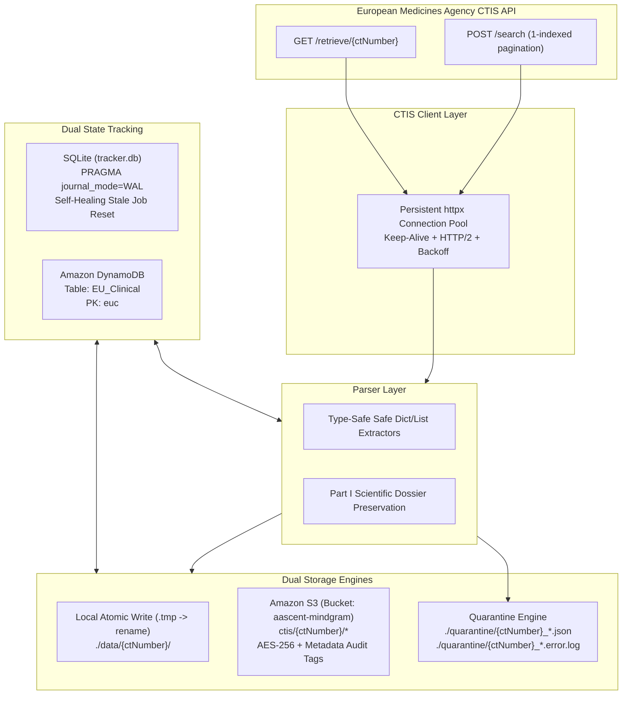

# EU CTIS Data Pipeline - ETL Implementation Guide

**Document Version:** 2.0 (Production Hardened & Cloud-Integrated)  
**Target Environment:** Local & Cloud Hybrid (SQLite/DynamoDB + Local/S3 storage with Docker multi-process orchestration)  
**Primary Data Source:** EU Clinical Trials Information System (CTIS) Public REST API (`https://euclinicaltrials.eu/ctis-public-api`)  

---

## 1. Project Overview & Scope

The objective is to operate a reliable, maintainable, self-healing, and incremental Python ETL (Extract, Transform, Load) pipeline that ingests clinical trial records from the European Medicines Agency (EMA) CTIS public API, transforms them into 6 domain-specific JSON files per trial, and persists them to local storage and Amazon S3 with dual state tracking in SQLite and Amazon DynamoDB.

### 1.1 Critical Domain Context

* **Volume & Database Scope:**
  * The public CTIS search portal exposes trials submitted under the EU Clinical Trials Regulation (CTR EU No 536/2014, in force since January 31, 2022).
  * As of late 2026, CTIS hosts approximately **~12,500–13,000 trials**.
  * The historical legacy database **EudraCT** contains older trials (~31,000+ studies). EudraCT is separate and not exposed by the CTIS public API endpoints. This pipeline strictly targets the modern **CTIS API**.
* **Target Output:**
  * Each clinical trial (`ctNumber`, e.g., `2026-527084-15-00`) is parsed into a dedicated folder or S3 key prefix containing **6 discrete JSON files**.
  * Deeply nested structures from the raw monolithic API response are normalized into clean, modular entities.
* **Core Engineering Principles:**
  * **Idempotency:** Re-running the pipeline on previously processed data must not corrupt state or duplicate records.
  * **Three-Process Synchronization:**
    1. *Process 1 (Historical Backfill):* Ingests the entire catalog (~12,500 trials) across all pages.
    2. *Process 2 (New Trials Sync):* Runs periodically (e.g. every 6 hours) with a 7-day lookback window to capture newly registered trials.
    3. *Process 3 (Updates Sync):* Runs daily (e.g. at 02:00 AM UTC) with a 7-day lookback window to capture amended trials.
  * **Zero Data Loss Schema Evolution:** Deep nested structures (such as Part I scientific dossiers) are preserved as raw dictionaries to protect against upstream EMA schema additions.
  * **Fault Tolerance & Quarantine:** Malformed records or schema regressions are trapped into a dedicated quarantine store rather than terminating batch execution.
  * **Production Guardrails:** Connection pooling, jittered exponential backoffs, strict all-file write verification, AES-256 S3 encryption, rotating log files, and graceful shutdown signal trapping.

---

## 2. System Architecture



---

## 3. API Specification & Live Behavioral Quirks

The CTIS public platform exposes two key endpoints. **Both require standard browser-like headers (specifically `User-Agent` and `Content-Type: application/json`).**

### 3.1 Search Endpoint (Catalog & Pagination)

* **URL:** `https://euclinicaltrials.eu/ctis-public-api/search`
* **Method:** `POST` *(Note: `GET` is disallowed and returns HTTP 405/400)*
* **Headers:**
  ```http
  Content-Type: application/json
  User-Agent: Mozilla/5.0 (Windows NT 10.0; Win64; x64) AppleWebKit/537.36
  ```

#### Live Request Rules & Caveats:
1. **1-Indexed Pagination:** The API expects `"page": 1` for the first page. Passing `"page": 0` returns `totalRecords: 0` and empty results.
2. **Mandatory `searchCriteria` Object:** The request payload **must** include `"searchCriteria": {}`. Omitting it will return 0 records.
3. **Sort Fields:** To fetch the most recently evaluated or updated trials first, sort by `decisionDate` or `lastPublicationUpdate` in `DESC` order.
4. **Date Parsing:** Dates in `data[]` are formatted as `DD/MM/YYYY` strings (e.g. `"07/10/2026"`), occasionally prefixed by country identifiers (e.g. `"HU: 07/10/2026"`). Prefix stripping via regex is applied before parsing.

#### Request Body Structure:
```json
{
  "pagination": {
    "page": 1,
    "size": 100
  },
  "sort": {
    "property": "decisionDate",
    "direction": "DESC"
  },
  "searchCriteria": {}
}
```

---

### 3.2 Retrieve Endpoint (Detailed Dossier)

* **URL:** `https://euclinicaltrials.eu/ctis-public-api/retrieve/{ctNumber}`
* **Method:** `GET`
* **Example:** `https://euclinicaltrials.eu/ctis-public-api/retrieve/2026-527084-15-00`

#### Live Quirks & Edge Cases:
* **Missing Trials Return HTTP 200 `{}`:** Non-existent trial numbers return `200 OK` with an empty JSON object `{}` instead of `404 Not Found`. Always verify that `data.get("ctNumber") == ctNumber`.
* **HTML Error Pages:** On upstream gateway glitches, responses may contain HTML markup with `200 OK`. The client verifies that `Content-Type` is JSON before decoding.
* **Payload Latency:** Complete trial dossiers range between 50KB and 2MB+ with extensive sponsor, site, and document arrays. Connect timeout is set to 10s and read timeout to 30s.
* **Timestamps:** Unlike the search endpoint, the retrieve endpoint uses ISO-8601 timestamps (e.g. `"2026-10-07T15:43:07.693"`).

---

## 4. Normalization Contracts: The 6 Output Entities

For every ingested trial, the pipeline splits the raw dossier into **exactly 6 JSON entities**, saved under `./data/{ctNumber}/` (or S3 `ctis/{ctNumber}/`):

```text
./data/{ctNumber}/
├── meta_data.json
├── summary.json
├── full_trial_information.json
├── trial_documents.json
├── trial_results.json
└── locations_and_contact_points.json
```

| Entity File | Primary Source Fields | Purpose & Normalization Behavior |
| :--- | :--- | :--- |
| **`meta_data.json`** | Root: `ctNumber`, `ctStatus`, `decisionDate`, `publishDate`, `ctPublicStatusCode`, `trialRegion`, `events`, `correctiveMeasures` | Status lineage, regulatory events, ingested UTC timestamp, and pipeline version. |
| **`summary.json`** | `authorizedPartI.trialDetails.clinicalTrialIdentifiers`, `sponsors`, `trialCategory.trialPhase`, `medicalConditions`, `therapeuticAreas` | High-level summary view for search indexing and summary dashboards. |
| **`full_trial_information.json`** | Entire `authorizedApplication.authorizedPartI` object | Scientific protocol, inclusion/exclusion criteria, trial design, and medicinal products. Stored directly to prevent schema regressions. |
| **`trial_documents.json`** | Root: `documents` list | Attached regulatory documents catalog (titles, UUIDs, languages, document types). |
| **`trial_results.json`** | Root: `results` object | Clinical trial results and study reports (persisted as `{}` if none submitted yet). |
| **`locations_and_contact_points.json`** | Merged from `authorizedPartsII` (member states, trial sites, organizations) and `sponsors[*].publicContacts`/`scientificContacts` | Geographic coverage across EU countries, investigator sites, and regulatory contact points. |

---

## 5. State Management & Multi-Process Concurrency

State tracking guarantees idempotency, resumability, and collision-free concurrency:

### 5.1 SQLite State Storage (`tracker.db`)
* **WAL Mode (`PRAGMA journal_mode=WAL;`):** Enables non-blocking concurrent reads and serialized writes. The background historical crawler and recurring cron tasks execute simultaneously without hitting `database is locked` errors.
* **Busy Timeout (`PRAGMA busy_timeout=30000;`):** Waits up to 30 seconds for concurrent writes to commit.
* **State Machine:**
  * `PENDING`: Discovered, awaiting ingestion.
  * `PROCESSING`: In-flight; locked so concurrent processes or cron runs will not double-process it.
  * `UPDATE_PENDING`: Existing trial whose publication date is newer than the recorded date.
  * `SUCCESS`: Fully extracted, verified, and saved to S3/disk.
  * `FAILED`: Exceeded retry threshold (quarantined).
* **Self-Healing Stale Job Recovery:** On startup and before batch runs, `reset_stale_processing(timeout_minutes=15)` scans for trials stuck in `PROCESSING` (e.g. from container restarts or worker crashes) and resets them to `PENDING`.

### 5.2 Amazon DynamoDB (`EU_Clinical`)
* **Partition Key:** `euc` (holds the `ctNumber`, e.g. `2026-527084-15-00`).
* **Adaptive Retry Mode:** Configured with `botocore` adaptive retries (`max_attempts=4`) to avoid capacity throttling during high-throughput backfills.

---

## 6. Resilience, Concurrency & Quality Controls

### 6.1 Connection Pooling & Rate Limiting
* **Thread Pool:** Uses `concurrent.futures.ThreadPoolExecutor(max_workers=5)`.
* **Connection Pool:** Uses persistent `httpx.Client` with HTTP keep-alive, connection limits, and polite delay pacing (`0.05s`) between requests.
* **Jittered Exponential Backoff:** On HTTP 429, 502/503/504, or network timeout:
  $$\text{wait\_time} = 2^{\text{attempt}} + \text{uniform}(0.1, 1.0)$$

### 6.2 Schema Validation vs. Resilient Evolution
* **Defensive Extractors:** `_safe_dict()` and `_safe_list()` protect against unexpected null or type shifts.
* **Pydantic V2 Models:** Built with `model_config = ConfigDict(extra="allow")` so newly introduced regulatory fields pass validation without errors.

### 6.3 Strict All-or-Nothing Storage Verification
* Before updating state to `SUCCESS`, `storage.py` verifies that **all 6 files** were written/uploaded and that each file size is strictly greater than zero bytes (`all(save_results.values())`). If any file fails, the trial status is reverted to retry/quarantine.

### 6.4 Storage Security
* **S3 Server-Side Encryption:** All uploads enforce `ServerSideEncryption="AES256"`.
* **Audit Metadata Tags:** Direct injection of `ct-number`, `ingested-at`, and `filename` into S3 object user metadata for auditing.

### 6.5 Quarantine Mechanism
* When validation or payload extraction fails:
  1. Raw payload is saved to `./quarantine/{ctNumber}_{timestamp}.json`.
  2. Complete stack trace is written to `./quarantine/{ctNumber}_{timestamp}.error.log`.
  3. Status is recorded as `FAILED` with retry tracking.

### 6.6 Graceful Shutdown & Log Rotation
* Intercepts `SIGINT` and `SIGTERM` signals, letting active workers finish writing and commit state before exiting.
* Limits log files via `RotatingFileHandler` (10 MB max, 5 backup files).

---

## 7. Application Code Structure

```text
eu_clinical_trial/
├── data/                             # Ingested trial JSONs (./data/{ctNumber}/)
├── quarantine/                       # Malformed or failed trial payloads
├── logs/                             # Execution and error logs (rotating)
├── tracker.db                        # Local SQLite state tracking database
├── requirements.txt                  # Python dependencies
├── Dockerfile                        # Multi-stage production container
├── docker-compose.yml                # Multi-process container orchestration
├── crontab                           # Scheduled cron jobs for new and update syncs
├── entrypoint.sh                     # Container initialization and process dispatch
├── .env                              # Secrets and runtime configuration
├── .env.example                      # Configuration template
├── ctis_etl/
│   ├── __init__.py
│   ├── config.py                     # Environment variables, backend switches, timeouts
│   ├── database.py                   # SQLite (WAL) & DynamoDB with stale job reset
│   ├── api_client.py                 # Persistent httpx client, pooling, and backoff
│   ├── models.py                     # Resilient Pydantic models (extra="allow")
│   ├── parser.py                     # Safe JSON splitting into 6 domain files
│   ├── storage.py                    # Atomic local write & S3 AES-256 upload
│   └── main.py                       # CLI entry point, signal handling, and modes
└── docs/                             # Comprehensive technical documentation
```

### 7.1 Required Dependencies (`requirements.txt`)
```text
httpx>=0.27.0
pydantic>=2.6.0
tenacity>=8.2.0
python-dotenv>=1.0.0
boto3>=1.34.0
botocore>=1.34.0
```

---

## 8. CLI Command Dispatches

The orchestrator (`ctis_etl/main.py`) supports 7 distinct operational modes:

| Mode | Command | Description |
| :--- | :--- | :--- |
| **Health Check** | `python -m ctis_etl.main --mode check` | Runs pre-flight diagnostics across API, storage, and database. |
| **Historical** | `python -m ctis_etl.main --mode historical --workers 5` | Full backfill of all historical trials across all search pages. |
| **New Trials** | `python -m ctis_etl.main --mode new --lookback-days 7` | Queries and ingests only newly registered trials within the window. |
| **Updates** | `python -m ctis_etl.main --mode updates --lookback-days 7` | Queries and updates existing trials with newer publication dates. |
| **Incremental** | `python -m ctis_etl.main --mode incremental --lookback-days 7` | Combined run processing both new and updated trials. |
| **Single Trial** | `python -m ctis_etl.main --mode single --ct-number 2026-527084-15-00` | Ingests or re-syncs a single specific clinical trial ID. |
| **Retry Failed** | `python -m ctis_etl.main --mode retry-failed` | Retries all previously quarantined or failed trials. |

---

## 9. Production Docker Deployment & Automation

The pipeline runs inside Docker with automated cron scheduling:

```bash
# 1. Start pipeline container in detached mode
docker compose up -d

# 2. View streaming logs
docker compose logs -f

# 3. Run diagnostic check inside container
docker compose exec ctis-etl python -m ctis_etl.main --mode check
```

### Automated Scheduling Breakdown (`crontab`):
* **On Container Startup:** Launches background historical backfill (`--mode historical`).
* **Every 6 Hours (`0 */6 * * *`):** Executes new trials synchronization (`--mode new --lookback-days 7`).
* **Daily at 02:00 AM UTC (`0 2 * * *`):** Executes update synchronization (`--mode updates --lookback-days 7`).
